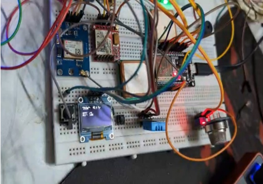
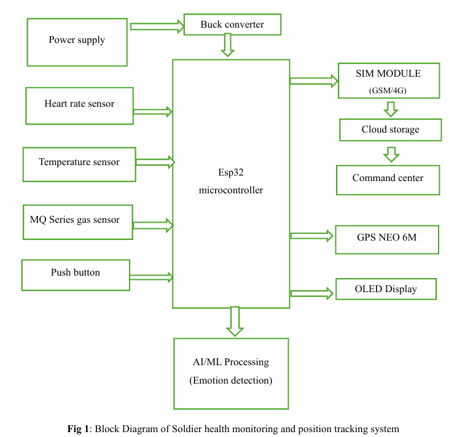
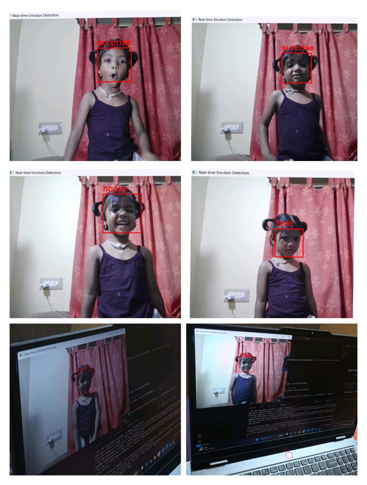
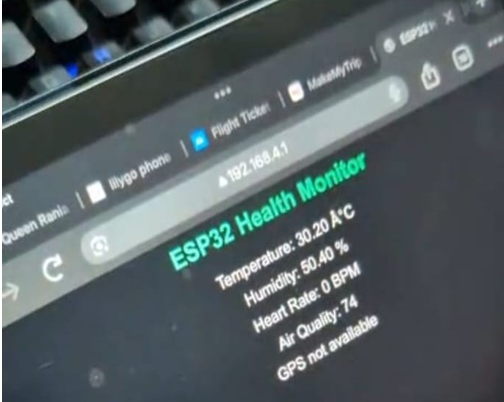

# Soldier Health Monitoring and GPS Tracking System

An IoT-based system built on ESP32 to monitor a soldier's vital health parameters and live GPS location in real time, with an SOS alert mechanism for emergencies.

---

## 📌 Overview

This project was developed as a final year engineering project. It uses an ESP32 microcontroller along with health and location sensors to continuously track a soldier's vital signs (such as heart rate, body temperature, etc.) and live GPS coordinates, transmitting this data to a remote dashboard so commanding units can monitor soldier safety in the field. An SOS button allows the soldier to manually trigger an emergency alert.

> Replace this paragraph with a 4-6 line summary from your project report's abstract for the most accurate description.

---

## 🚀 Features

- Real-time heart rate and body temperature monitoring
- Live GPS location tracking
- SOS emergency alert system
- Wireless data transmission via ESP32 (Wi-Fi/GSM)
- Dashboard for live monitoring of soldier vitals and location
- [Add/remove features based on what your system actually does]

---

## 🧩 System Architecture

> Replace `block_diagram.png` with your actual block/architecture diagram filename once uploaded.

---

## 🔧 Hardware Components

| Component | Purpose |
|---|---|
| ESP32 | Main microcontroller, Wi-Fi/BLE communication |
| GPS Module (e.g., NEO-6M) | Location tracking |
| Heart Rate Sensor (e.g., MAX30100) | Pulse monitoring |
| Temperature Sensor (e.g., DS18B20) | Body temperature monitoring |
| SOS Push Button | Manual emergency trigger |
| [Add any other sensors/modules used] | |

> Edit this table to match the exact components from your report.

---

## ⚙️ Circuit Diagram

---

## 💻 Software & Tools Used

- Arduino IDE (firmware for ESP32)
- [Backend/dashboard tool — e.g., Firebase, Blynk, Node.js, Flask]
- OpenCV (if used for any vision-based detection feature — describe its role here)
- [Any other library/tool/language used]

---

## 📊 How It Works

1. Sensors continuously read the soldier's vitals and GPS coordinates.
2. ESP32 processes and transmits this data wirelessly to the server/dashboard.
3. The dashboard displays live health status and location on a map.
4. If a critical parameter crosses a threshold, or the SOS button is pressed, an alert is sent to the monitoring station.

> Rewrite this section in your own words based on your actual report's working/methodology section.

---

## 📷 Project Gallery

| Block Diagram | Circuit Build |
|---|---|
|  |  |

| Dashboard | SOS Alert |
|---|---|
|  |  |

> Update the image filenames above to exactly match what you upload to the `images/` folder.

---

## 🎥 Demo Video

Click the thumbnail above to watch the full project demo on YouTube.

---

## 📄 Project Report & Presentation

- 📘 [Project Report (PDF)](projectreport.pdf)
- 📊 [Project Presentation (PPTX)](onelastfinal.pptx)

---

## 🔮 Future Scope

- Integration with a mobile app for real-time alerts
- Adding more vital sensors (e.g., SpO2, ECG)
- Improving GPS accuracy in low-network zones
- [Add your own future scope points from the report]

---

## 👨‍💻 Author

**[Your Name]**
Final Year Project — [Your College/University Name]
[Your LinkedIn / Email — optional]

---

## 🏷️ Topics

`iot` `esp32` `embedded-systems` `gps-tracking` `opencv` `arduino` `final-year-project`
